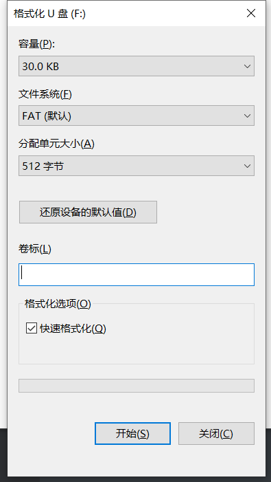
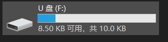

## ***template project***

this is a template project, using the CubeMX code frame

这是一个模版例程，使用的CubeMX的代码框架，用CubeMX生成初始化代码，使用MDK5进行编译

## 开发板上机测试

如果开发板一切正常，那么插串口对应的TypeC连接电脑，L2会闪烁，按下Key切换模式，L2闪烁频率会改变，同时上位机会接收到模式的信息。

如果插开发板的USB对应的TypecC连接电脑，电脑会出现格式化U盘，然后格式化完后，会模拟出一个U盘。

	

	

	

