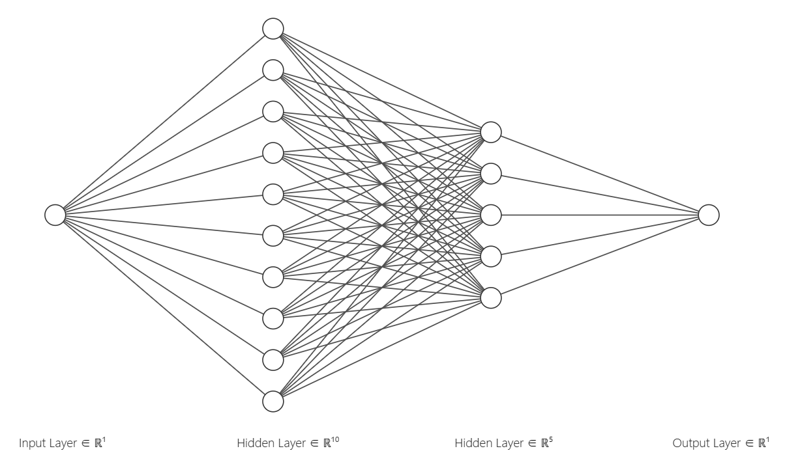
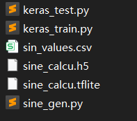
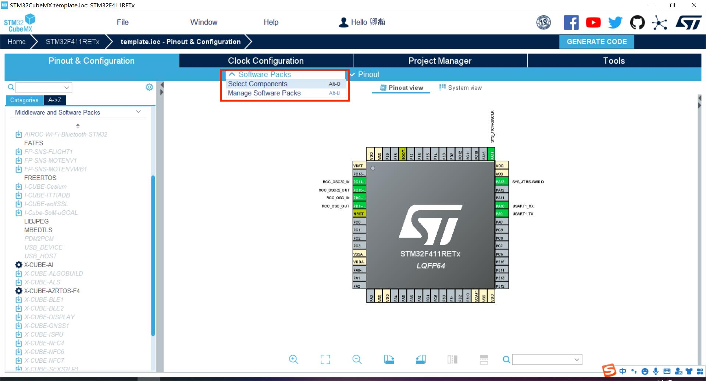
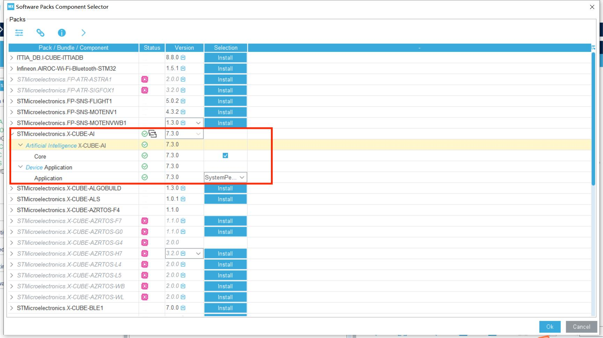
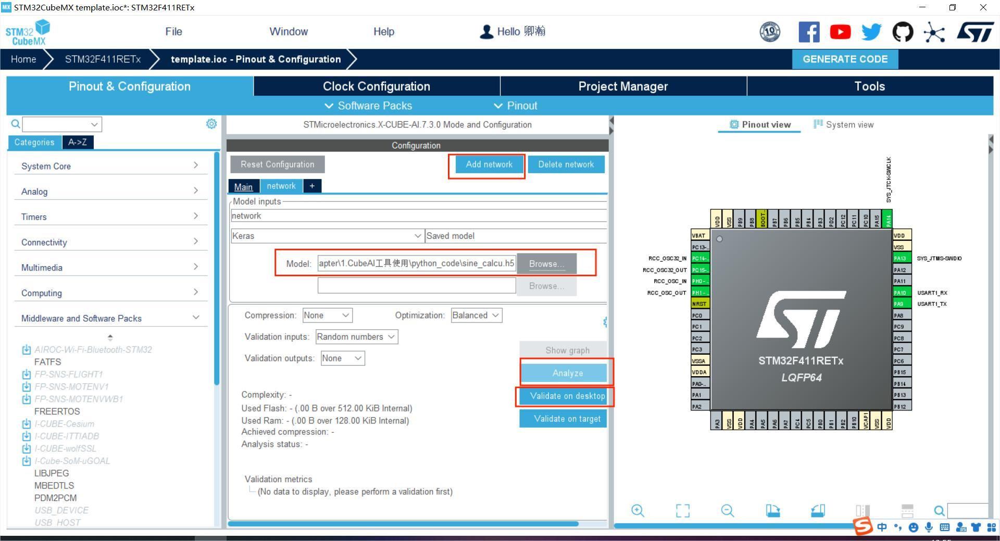
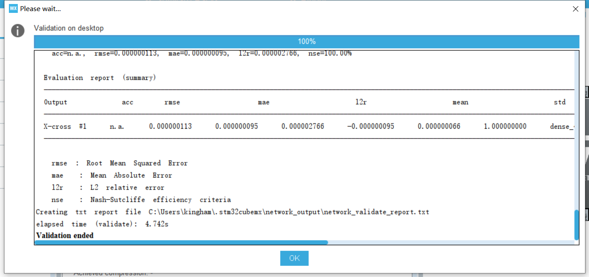
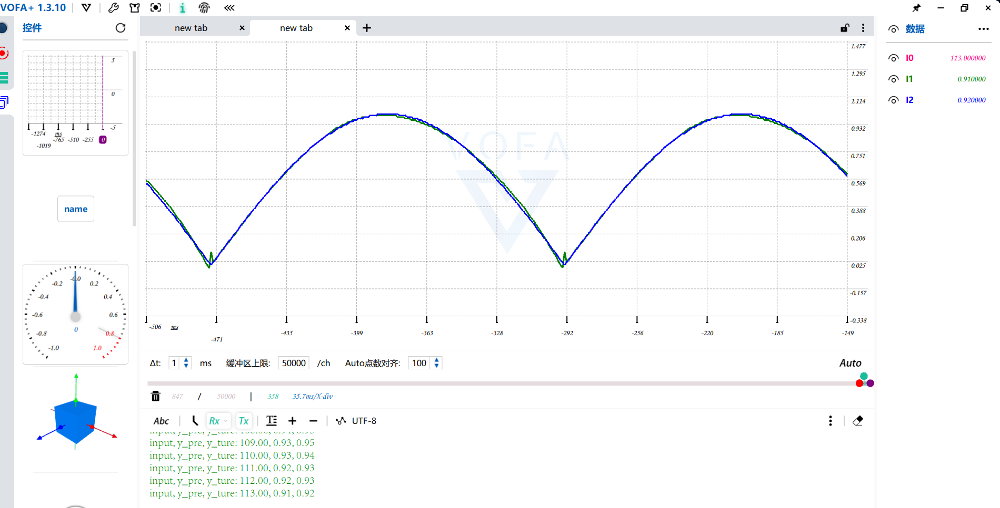

## ***Cube AI Demo***

​	*该例程使用Cube AI套件，在STM32上运行一个神经网络，功能实现分为以下几个步骤：*

## 一、搭建一个神经网络

### 1. 模型搭建

​	这里是我们的目标是预测正弦函数。给定一个输入，范围(0, 180)，输出其对应的正弦值范围(0, 1)。搭建的网络结构如下图所示：



### 2. 生成sin(x)数据，进行模型的训练

​	在./python_code文件夹中已经给出所有的文件，请自行查看。在这里生成sin(x)的一系列数据后，使用keras框架搭建模型进行训练，激活函数使用tanh，没有使用sigmod是因为其不能表达负数的部分。学习率设置为0.001，epoch设置为2000。最后生成.h5和.tflite文件。

```python
#导入工具包
import tensorflow as tf
import pandas as pd
import numpy as np

#读取数据
data = pd.read_csv('./Embedded_things/sin_values.csv', sep=',', header=None)
raw_x = data.iloc[:,0].astype(float)
sinex = data.iloc[:,1].astype(float)
print(sinex.shape)

#建立模型
model = tf.keras.Sequential()
model.add(tf.keras.layers.Dense(units=10, activation='tanh', input_shape=(1,)))
model.add(tf.keras.layers.Dense(units=5, activation='tanh'))
model.add(tf.keras.layers.Dense(units=1))
model.summary()

model.compile(optimizer=tf.keras.optimizers.AdamW(0.001),
             loss=tf.keras.losses.mse,                      #loss使用均方差，刚才的分类用的交叉熵
             metrics=[tf.keras.metrics.mse])
history = model.fit(x=raw_x, y=sinex, epochs=2000)

print(model.evaluate(raw_x, sinex))

#保存模型
model.save('./Embedded_things/sine_calcu.h5')

#转换模型为tf lite格式 不量化
load_model = tf.keras.models.load_model('./Embedded_things/sine_calcu.h5')
converter = tf.lite.TFLiteConverter.from_keras_model(load_model)
tflite_model = converter.convert()
open("./Embedded_things/sine_calcu.tflite", "wb").write(tflite_model)
```

​	如果想测试一下模型，可以看一下test.py，这里就不过多进行阐述。以下是在./python_code中所有的文件，读者请自行查阅。



## 二、STM32工程创建

### **1.打开CubeMX，把常规的设置都设置好，打开串口**等

### **2.打开select components**，选上X-CUBE-AI





### **3.添加网络，选择你的模型（.h5或.tflite），再进行验证**





### **4.生成工程**

点击生成代码即可

### **5.更改代码**

详见仓库代码内容和手册教程

### **5.验证**

​	通过串口传数据到上位机VAFA，其中蓝色的线为准确的sin(x)的值，绿色的为模型输出的值，可以看到拟合的比较好，但是在接近sin(x)=0的附近，拟合的比较不好。



