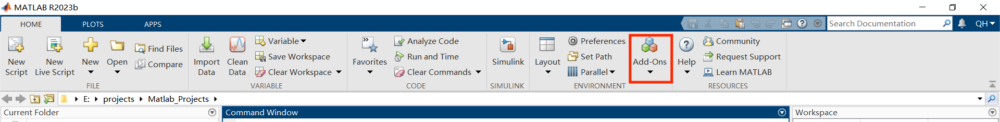
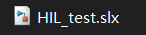
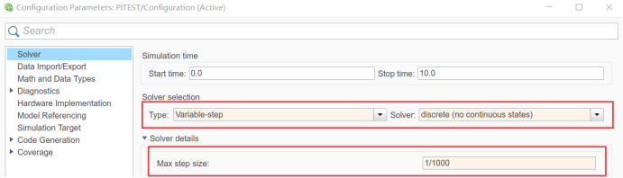
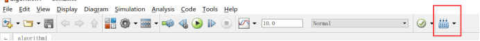
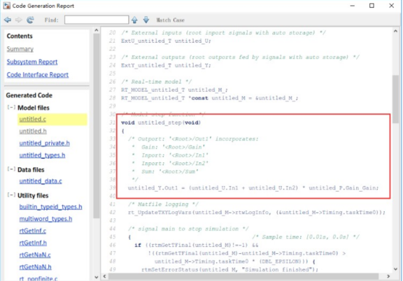
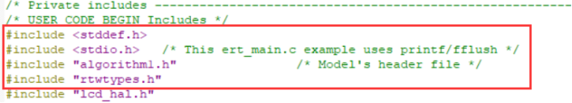

## ***simulink hardware-in-the-loop(HIL) Demo***

​	*该例程使用simulink对STM32F4进行在环开发，功能实现分为以下几个步骤：*

## 一、simulink在环开发

**1.在matlab下载STM的硬件支持包，这里还有很多搭建环境的步骤就不一一说明了**

**2.配置好所有环境后，创建simulink工程和cubemx工程。注意这里需要先配置好CubeMx和cubeprogramer**

**3.在库中找到STM，搭建好模型，再在simulink进行设置，并指定刚才cubemx工程的路径**

**4.编译+部署。有可能会出现一些cubemx的报错，按照提示排除就好**

## 二、附加内容：simulink生成算法代码，嵌入到设备

**1.创建文件夹在D盘或者其他盘的目录下，我这里创建了如下文件夹**

**2.在Simulink中创建一个新的仿真图，PI等种种模块，都需要改成离散的！以下图的简单算法作为例子。**

**3.打开设置，如下这两处需要更改，step size可以尝试一下设置，还没试出什么影响。**

**3.打开code generation，更改system target file为ert.tlc，此为embedded coder，语言设置成想要的（一般都是C吧）。**

**4.打开code Generation 的Report选项，把如下两个选项勾选，到时生成代码会弹出弹窗给你方便看一点。**

**5.现在就已经可以点击生成代码，如下图所示。**

**6.但是现在的代码还很乱，可以选择性进行如下操作，首先将算法部分封装起来。**

**7.然后，再双击数据线命名，不然到时候全是结构体，很难受。**

**8.而后进入Model Explorer，点击Add，然后点击Add Custom。**

**9.添加备注的信号线等，设置为mpt.signal。**

**10.添加x,y,z信号对象后，须要关联信号名，关联信号名，在信号线上右键，点击Signal Properties…，点击Signal Properties…后，按下图勾选Signal name must resolve to Simulink signal object ，让信号名解析到信号对象上去 ，x,y,z都按以下设置，保存。**

**11.把模块单独出来做为一个子系统，能够把算法单独放在一个文件中当做一个函数使用，选中你的封装好的算法，在菜单栏点击Diagram->Block Parameter (Subsystem )。**

**12.按ctrl+B或者点击代码生成，最终代码预览如下。**

**13.最后生成的代码自动创建如下子目录。**

**14.上机测试部分。把需要的.c和.h文件全复制到你的工程文件下。**

**15.测试**

