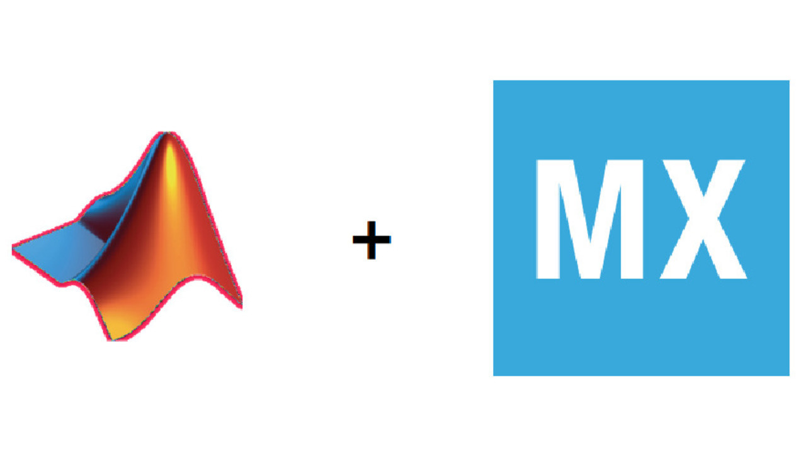

  <b>中文</b> | <a href="./README_Eng.md">English</a> 

<h1 align="center">FryPi 炸鸡派</h1>

        
        
        

<h3 align="center">STM32F411RET6开发板</h3>

	

	

	<a href="https://space.bilibili.com/34154740">bilibili主页 </a> |
	<a href="https://www.bilibili.com/video/BV19g4y1N7YR/">演示视频 </a> |
    <a href="https://oshwhub.com/no_chicken">硬件开源 </a> 

## :ledger: 简介

这是一个比手掌还小的STM32F411RET6迷你开发板，可以用于AI开发，UI开发，数字电源控制板等等，甚至可以拿去用于你的毕业设计和其他相关的项目。

	

最开始做这块板子的目的是因为上一个智能手表的项目*[OV-Watch](https://github.com/No-Chicken/OV-Watch)*，很多复刻的人说器件非常难焊接，二次开发不太方便，再加上我也打算在STM32上部署一下AI相关的东西，做下教程，因此，FryPi炸鸡派就诞生了。

## :rocket: Features

  - MCU使用STM32F411RET6，Cortex-M4 core with DSP and FPU，512 Kbytes of Flash memory, 100 MHz CPU, ART Accelerator，.
  - 可额外焊接外置SPI Flash.
  - 例程丰富：[智能手表](https://github.com/No-Chicken/FryPi/tree/master/2.software/2.Advanced/6.LVGL%E6%99%BA%E8%83%BD%E6%89%8B%E8%A1%A8)，[热成像手势识别](https://github.com/No-Chicken/FryPi/tree/master/2.software/2.Advanced/3.%E7%83%AD%E6%88%90%E5%83%8F%2B%E6%89%8B%E5%8A%BF%E8%AF%86%E5%88%AB)，[手写数字识别](https://github.com/No-Chicken/FryPi/tree/master/2.software/2.Advanced/2.%E6%89%8B%E5%86%99%E6%95%B0%E5%AD%97%E8%AF%86%E5%88%ABMNIST)，与matlab联合开发，[simulink在环开发](https://github.com/No-Chicken/FryPi/tree/master/2.software/2.Advanced/5.simulink%E8%81%94%E5%90%88%E5%BC%80%E5%8F%91)等等.
  - 留有端口可外接扩展板.（例如最上面的演示动态图，就是在Core板插上Cam扩展板）
  - 有双TypeC和单TypeC版本的Core板.
  - 
