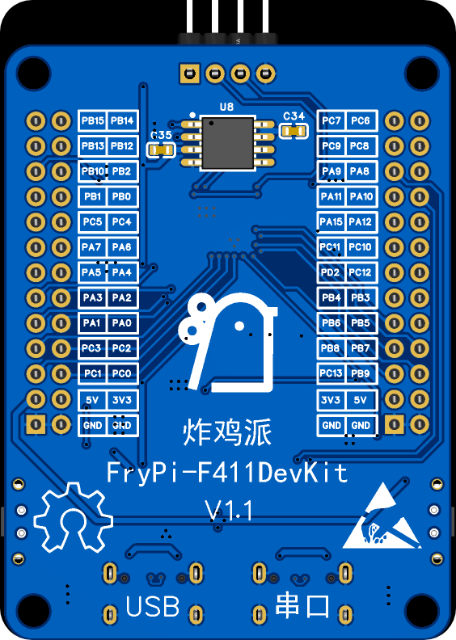
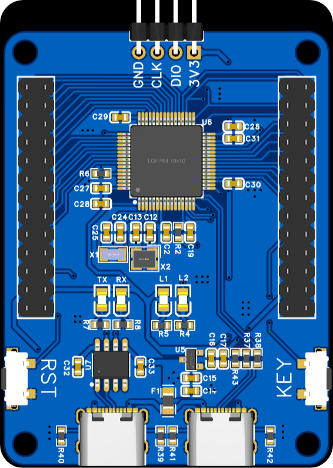
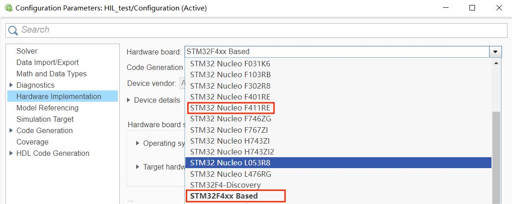
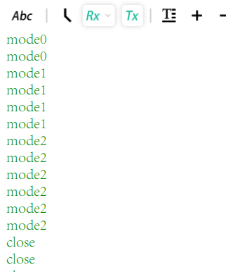
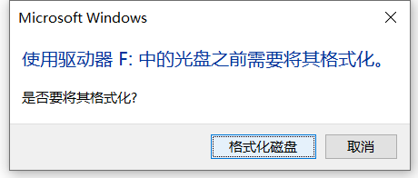

  <b>中文</b> | <a href="./README_Eng.md">English</a> 

<h1 align="center">FryPi 炸鸡派</h1>

        
        
        

<h3 align="center">STM32F411RET6开发板</h3>

	
    &nbsp;
    

	
    &nbsp;
    

	<a href="https://space.bilibili.com/34154740">bilibili主页 </a> |
	<a href="https://www.bilibili.com/video/BV19g4y1N7YR/">演示视频 </a> |
    <a href="https://oshwhub.com/no_chicken">硬件开源 </a> 

## :ledger: 简介

这是一个比手掌还小的STM32F411RET6迷你开发板，可以用于AI开发，UI开发，数字电源控制板等等，甚至可以拿去用于你的毕业设计和其他相关的项目。

	
    &nbsp;
    

最开始做这块板子的目的是因为上一个智能手表的项目[OV-Watch](https://github.com/No-Chicken/OV-Watch)，很多复刻的人说器件非常难焊接，二次开发不太方便，再加上我也打算在STM32上部署一下AI相关的东西，做下教程，因此，FryPi炸鸡派就诞生了。这一块开发板不仅适用于初学者，也适用于进阶开发者，项目中的高级例程可能需要一定的知识储备。

同时，选这个MCU的原因也是因为STM32F411REU6可以完美替代原来智能手表项目的CEU6，而且在simulink中也有F411的硬件选项。

	

## :rocket: 功能特点

  - MCU使用STM32F411RET6，Cortex-M4 core with DSP and FPU，512 Kbytes of Flash memory, 100 MHz CPU, ART Accelerator，.
  - 可额外焊接外置SPI Flash.
  - 例程丰富：高级例程：[智能手表](https://github.com/No-Chicken/FryPi/tree/master/2.software/2.Advanced/6.LVGL-SmartWatch)，[热成像手势识别](https://github.com/No-Chicken/FryPi/tree/master/2.software/2.Advanced/3.Thermal-camera-gesture-recognition)，[手写数字识别](https://github.com/No-Chicken/FryPi/tree/master/2.software/2.Advanced/2.%20MNIST-Handwritten-number-recognition)，与matlab联合开发，[simulink在环开发](https://github.com/No-Chicken/FryPi/tree/master/2.software/2.Advanced/5.simulink-Co-develope)等等.
  - 留有端口可外接扩展板.（例如最上面的演示动态图，都是在Core板插上Cam扩展板）
  - 有双TypeC和单TypeC版本的Core板.

## :package: 开机测试

开发板焊接完毕拿到手后，烧录[模板例程](https://github.com/No-Chicken/FryPi/tree/master/2.software/1.Basic/0.template)观察现象，如果硬件没有问题，那么插串口对应的TypeC连接电脑，L2会闪烁，按下Key切换模式，L2闪烁频率会改变，同时上位机会接收到模式的信息；

	
    &nbsp;
    

如果插开发板的USB对应的TypecC连接电脑，电脑会出现格式化U盘，然后格式化完后，会模拟出一个U盘。

	

## :memo:例程目录

例程demo如下目录所示，分为基础例程Basic，和高级例程Advanced。

- [Basic](./2.software/1.Basic)
  - [0.template](./2.software/1.Basic/0.template)
  - [1.GPIO](./2.software/1.Basic/1.GPIO)
  - [2.USART](./2.software/1.Basic/2.USART)
  - [3.TIM](./2.software/1.Basic/3.TIM)
  - [4.PWM](./2.software/1.Basic/4.PWM)
  - [5.ADC](./2.software/1.Basic/5.ADC)
  - [6.SPI](./2.software/1.Basic/6.SPI)
  - [7.LCD](./2.software/1.Basic/7.LCD)
  - ...todo
- [Advanced](./2.software/2.Advanced)
  - [0.FreeRTOS模板](./2.software/2.Advanced/0.FreeRTOS)
  - [1.如何使用CubeAI](./2.software/2.Advanced/1.CubeAI)
  - [2.手写数字识别](./2.software/2.Advanced/2.MNIST-Handwritten-number-recognition)
  - [3.热成像手势识别](./2.software/2.Advanced/3.Thermal-camera-gesture-recognition)
  - [4.使用VScode EIDE插件](./2.software/2.Advanced/4.VScode-EIDE-build)
  - [5.simulink在环开发](./2.software/2.Advanced/5.simulink-Co-develope)
  - [6.LVGL智能手表](./2.software/2.Advanced/6.LVGL-SmartWatch)
  - [7.OV2640摄像头+识别](./2.software/2.Advanced/7.OV2640-recognition)
  - ...todo

## ✨贡献者

<table>
  <tbody>
    <tr>
      <td align="center" valign="top" width="16.66%">
           <b>不吃油炸鸡</b></a> <a title="Code">💻</a> <a title="Documentation">📖</a> <a title="Tests">⚠️</a> <a title="Reviewed Pull Requests">👀</a></td>
<td align="center" valign="top" width="16.66%">
           <b>花生大少</b></a>  <a title="Code">💻</a> <a title="Tests">⚠️</a> <a title="Ideas, Planning, & Feedback">🤔</a> <a title="Bug reports">🐛</a></td>
    </tr>
  </tbody>
</table>
